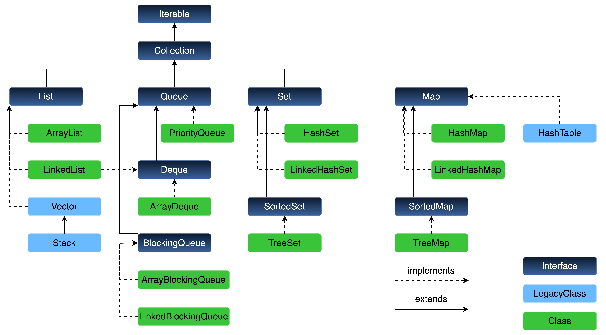

## Motivations / Purposes

## Goals / Non-Goals
- Always remember to achieve your goals
- Don't spend too much time on non-goals or tangent topics
- Aim for a minimal viable product first


## JVM memory
![[Pasted image 20251021183642.png]]

- **Method Area:** Stores class-level information like class name, parent class, methods, variables, and static data. Shared across the JVM.
- **Heap Area:** Stores all objects. Shared across the JVM.
- **Stack Area:** Each thread has its own runtime stack; stores method calls, local variables in stack frames. Destroyed when the thread ends.
- **PC Registers:** Hold the address of the currently executing instruction for each thread.
- **Native Method Stacks:** Each thread has a separate stack for native method execution.

### Access modifier: 
public private  
default (same package) -> protected (default + parent/child access for subclass outside of the package)

### Templates
Class vs interface vs abstract class vs enum vs annotation(@interface)

interface vs abstract class
- can implement multiple interfaces
- extends only one
- is-a vs has-a relationship

### Static
- Scope: field, method, class, block
- Template -> access elements from template instead of instance
- Checks JVM knowledge:
    - stack, heap, PC, ==method area==, native method stack(C/C++ backdoor for os level api)
    - Static things is stored in the method area
- Static modified stuff is only loaded once
- Static class must reside inside another class as an inner class
    - loading template to method area -> you can have static class

### Final
- Scope: field, method, class
- field: the memory address or primary type cannot be modified after initialization (on creation)
- method: the method cannot be overriden
- class: **prevents inheritance:** A `final` class cannot be extended by any other class.

### Immutable class
- final class
- **private** final field
- getters only, no setter
    - Getters return defensive copies: deep copies or unmodifiable copies
    - **In the constructor:** When receiving a mutable object, create a new copy of it for your internal field. Do not store the reference to the original object that was passed in.

- final method: ==No need for this because it's already a final class==
- examples: String type

### Override v.s. Overload difference
- runtime v.s. compile time polymorphism
- in-between classes vs within same class
- The scope of overriden exception handling can be narrower but cannot be wider
- Overload: **You CANNOT overload a method by changing only its return type.**

| How to Differentiate Methods                      | Is it Overloading? | Example                                         |
| ------------------------------------------------- | ------------------ | ----------------------------------------------- |
| **Different Method Name**                         | No                 | `add()` vs. `sum()`                             |
| **Same Name, Different # of Params**              | **Yes**            | `add(int, int)` vs. `add(int, int, int)`        |
| **Same Name, Different Param Types**              | **Yes**            | `add(int, int)` vs. `add(double, double)`       |
| **Same Name, Different Param Order**              | **Yes**            | `format(String, int)` vs. `format(int, String)` |
| **Same Name, Same Params, Different Return Type** | **No (Error)**     | `int add(int,int)` vs. `double add(int,int)`    |
| **Same Name, Same Params, Different Param Names** | **No (Error)**     | `add(int a, int b)` vs. `add(int x, int y)`     |
|                                                   |                    |                                                 |


### Factory pattern
You need the **Factory Design Pattern** to **decouple the code that _uses_ an object from the code that _creates_ the object.**

This separation makes your code dramatically cleaner, more flexible, and easier to maintain, especially as it grows in complexity.

### throws v.s. throw
The `throw` keyword is used **inside a method body** to immediately create and signal an exception. It performs the action of disrupting the normal flow of the program.

The `throws` keyword is used **in a method signature** to declare the exceptions that the method _might_ throw (but doesn't handle itself). It's a formal contract telling the caller what to expect.
- Let the caller of this method to handle the exception

#### when is finally not executed

| Scenario                           | Does `finally` Execute? | Why?                                                |
| ---------------------------------- | ----------------------- | --------------------------------------------------- |
| **Normal Execution**               | **Yes**                 | Standard program flow.                              |
| **Exception Thrown and Caught**    | **Yes**                 | Standard exception handling.                        |
| **`return` in `try`/`catch`**      | **Yes**                 | `finally` runs before the method exits.             |
| **`System.exit()` is called**      | **No**                  | The entire JVM is halted immediately.               |
| **Infinite loop in `try`/`catch`** | **No**                  | The execution point never reaches `finally`.        |
| **JVM crashes**                    | **No**                  | The execution environment is destroyed.             |
| **Code is in a Daemon thread**     | **No**                  | The JVM exits when all non-daemon threads are done. |


### Runtime v.s. Compile time exception

### Explain concepts
- when to use which
- Prove your experience instead recite facts

### Collection



--- 
## In-class Code
```java
package org.example;  
class Singleton {  
    private static final Singleton instance = new Singleton();  
    private Singleton() {}  
    public static Singleton getInstance() {  
        return instance;  
    }  
}  
  
  
  
/*  
HashMap  
key1 -> value1  
key2 -> value2  
key3 -> value3  
key4 -> value4  
key5 -> value5  
  
HashSet  
key1 -> null  
key2 -> null  
key3 -> null  
key4 -> null  
key5 -> null  
  
Employee class into  
HashMap<Employee, Profile> as key -> case 1  
or just in HashSet<Employee> -> O(1) -> case 2  
Set vs Map  
Key-value map  
single vluae + deduplicate -> set  
????  
hash collision  
hashcode -> function  
Employee e1                           unique hash-value  
input         -> hashcode function -> output  
Hash Collision???  
Employee e1 -> hash-value1  
Employee e2 -> hash-value1  
             vsNormal update???  
Employee e1 -> hash-value1  
Employee e1 -> hash-value1  
hashcode + equals -> Employee extends Object -> e1.equals(e2) -> euqlas check each and every fields  
employee -> id, age, name, contactInfo, email, phoneNumber  
class template (Object) equals -> ==  
                       key2                         hashvalue1HashMap key1-value1 :  key1 -> hashcode function -> hashvalue1  
______________________________ Bucket(array)  
            |            V          value1            |            V          value2            |            V          vluae3            |            V            .... * 1m records O(1) -> O(n)        java 8 -> 8/16 -> linkedlist -> black and red tree data structure  
  
  
  
     OOP ->  
     Inheritance -> interface + abstract class + final  
     Encapsulation, -> access modifier  
     Polymorphism, -> override vs overload  
     Abstraction -> interface + abstract class  
  
     +  
     S -> single responsibility     O -> Open/Closed     L -> Loskov principle     I -> Interface segeration     D -> Dependency injection  
*/


package org.example;  
// public private default protected  
// default -> protected (default + parent/child access)  
// object/instance vs template  -> new instantiation  
// class vs interface vs abstract class vs enum vs annotation (@interface)  
// class MyClass implmeent interface1, 2, 3 extends AbstractClass  
// static -> field, method, class, ??? (block)  
// template -> access elements from template  
// why?  
// JVM -> Java Virtual Machine -> type of virtual machine  
// stack, heap, PC, method area, native method stack  
// final -> field, method, class                             finalize vs finally  
// ---> Employee class -> immutable class????  
// final -> class  
// private final fields  
// getter only, no setter  
// in getter, given referenced data type field, always return deep copy dummies  
/**  
 * Profile -> CellPhone, IDCard, *  public final Employee { *      final int age; *      final string name; *      final List<Friend> friends;  
 *      final Profile * *      // Getter method for age. name, friends *      // no setter *  } *  Employee e1 = new Employee(52, "David", new ArraYLsit()); *  e1.getFriends().add(new Employee("Rogor"XXXXX)); * */// if you put the final keyword on field,  
// it cannot be changed  
// Employee e1 = new Employee("David", 52, "male", "Senior SDE");  
// e1 = new Employee("Kyra", XX, "female", "Senior SDE");  
  
// mode? lazy -> eager loading  
public class Singleton {  
  //    static {  
  //        System.out.println("hello world");  //    }  //  //    static class MyStaticClass {  //  //    }  private static Singleton instance;  
  
    private Singleton() {  
    }  
    public static Singleton getInstance() {  
        if (instance == null) {  
            instance = new Singleton();  
        }  
        return instance;  
    }  
//    String s1 = new String("a");  
}  
  
// override vs overload difference  
// -> runtime vs compile time polymorphism  
// in-between classes vs within same class
```
## Related